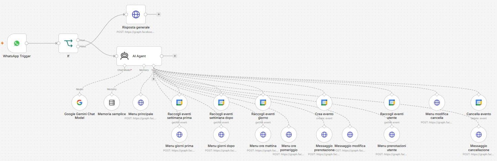
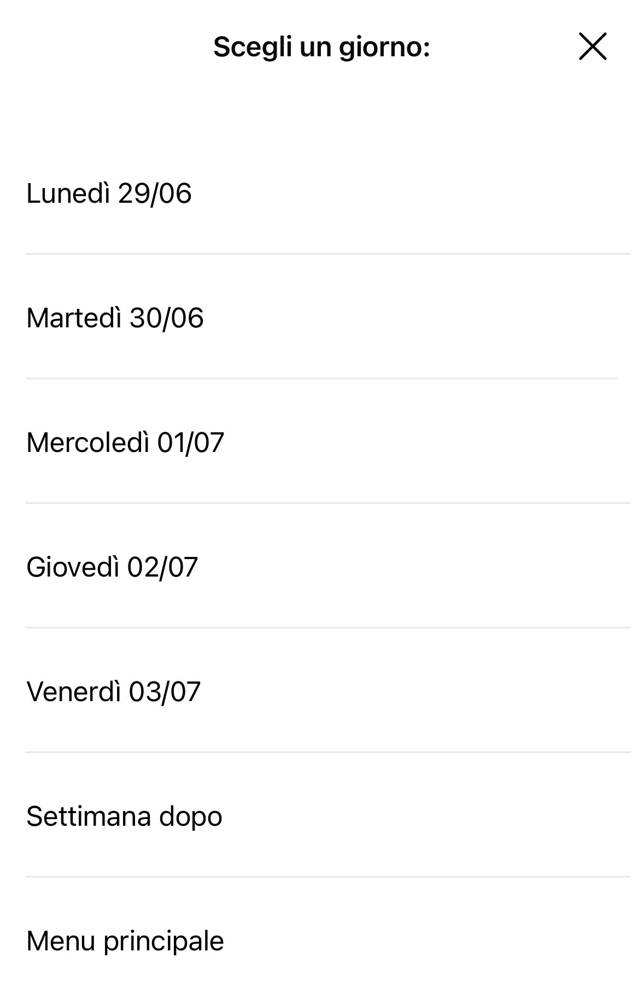
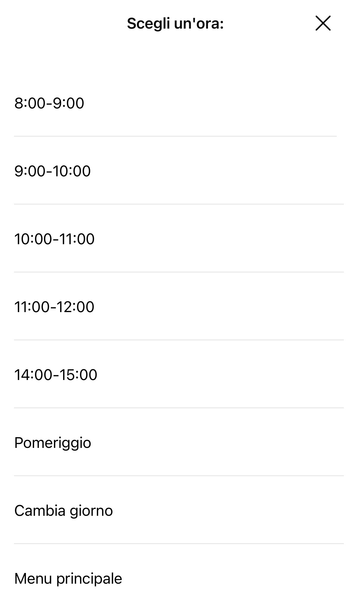

# AI-Agent Tennis Court Booking System

A WhatsApp-based booking assistant built with **n8n**, powered by an AI agent (**Google Gemini**) and integrated with **Google Calendar**. Users book, view, modify, and cancel tennis court reservations entirely through WhatsApp buttons and lists — no typing required.

This project was developed as part of an internship at AiperTech srl and formed the basis of my Bachelor's thesis in Computer Science at the University of Udine: *"Automazione del processo di prenotazione tramite agenti AI"*.

## What it does

- **Create** a booking: pick an available day, then an available time slot
- **View** your existing bookings
- **Modify** a booking: move it to a new day/time
- **Cancel** a booking
- Automatically checks real-time availability against Google Calendar so no slot is ever double-booked
- Fully guided interaction (buttons/lists only) to eliminate ambiguity for non-technical users

## Architecture

The system connects three external services through an n8n workflow:

1. **WhatsApp Cloud API** — receives and sends user messages via webhook
2. **AI Agent (Google Gemini)** — interprets the user's selection and decides which tools to call, guided by a structured system prompt
3. **Google Calendar API** — stores bookings as calendar events; the agent checks this calendar to compute free slots before presenting options

A single n8n workflow ties these together: an incoming WhatsApp message triggers the flow, an `IF` node distinguishes interactive replies (button/list taps) from free text, and the AI agent then calls the appropriate tools (fetch events, send menu, create/delete event, send confirmation) in sequence.

## Tech stack

- **n8n** — low-code workflow automation (self-hosted via Docker)
- **Google Gemini API** — the LLM powering the agent's decision-making
- **Google Calendar API** — source of truth for bookings
- **WhatsApp Cloud API (Meta)** — messaging channel
- **Docker** — containerized runtime environment
- **ngrok** — public tunnel for local webhook testing

## Demo

| Choosing a day | Choosing a time | Confirmation |
|---|---|---|
|  |  |  |

## Repository contents

- `workflow.json` — exported n8n workflow (import into your own n8n instance; API tokens and IDs are replaced with placeholders)
- `system_prompt.txt` — the agent's system prompt defining its role, rules, and decision logic
- `screenshots/` — example interactions from testing

## Setup

1. Run n8n locally or self-hosted (see [n8n docs](https://docs.n8n.io/hosting/))
2. Import `workflow.json` into your n8n instance
3. Configure credentials for WhatsApp Cloud API, Google Calendar API, and Gemini API directly within n8n's credential manager (replace the placeholder values in `workflow.json` — e.g. `YOUR_WHATSAPP_ACCESS_TOKEN`, `YOUR_PHONE_NUMBER_ID`, `YOUR_CALENDAR_ID` — with your own)
4. Expose your local webhook with ngrok (or deploy to a permanent server) and set the resulting URL in WhatsApp's webhook configuration

## Known limitations

- Currently designed for local/development hosting (ngrok); production use would require a permanent server with a stable domain
- Availability calculation is delegated to the LLM agent, which occasionally produces inconsistent results due to the non-deterministic nature of language models — a planned improvement is to move this calculation into a dedicated deterministic n8n code node
- No automatic retry/error handling if an external API (WhatsApp, Calendar, Gemini) is temporarily unreachable

## Author

Mia Barić — [github.com/miabaric](https://github.com/miabaric)
